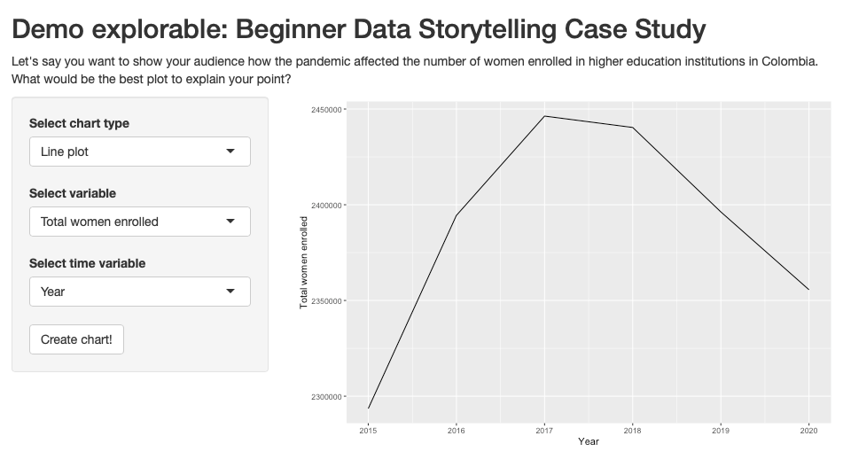

# R with RShiny

## :information_source: Read this before getting started
- The goal of exercises in case study is for learners to apply what was learned previous courses to new problems or situations. This is best pedagogical practice for retaining and building skills. Since the courses covered are conceptual, students will rely on manipulating the interactive visualizations that you create to practice their skills.

## Creating an Rshiny explorable

#### Dataset

- [x] Add datasets used to the `datasets/` folder

#### Files

- [x] **R Source file**: Add your RShiny app to the `exercises/`  folder with the name `app.R`. Please ensure your app includes all the packages required so we are able to run it locally. The app should use the dataset from the `datasets/` folder.

#### Learning Objective

Learner will be able to select the most useful type of chart according to a goal/question proposed by the instructor, the variables in the dataset and the identified audience.

#### Context

When you are crafting data-based stories with the help of data visualization, it is very important to recognize the adequate kind of graph to explain your message. Sometimes you will need to show how a variable evolves over time, others you'll want to view a variable's distribution, and ither times you want to show the relationships between variables. Let's see it in action! 

In the dashboard on the right you will find an option to select a chart type and some variables associated with it. After you select your desired options, click on the button to generate the plot.

#### Steps to be executed by the student (max 6)

- Step 1: Select a chart type in the dashboard. Currently, the options are histogram and line plot.
- Step 2: Based on the chart type selection, some variables will be shown to you. Select the ones with which you want to make the plot.
- Step 3: Click the button to create the plot.
- Step 4: Try different plot configurations.
- Step 5: Answer the question below.

#### Exercise question:

Let's say you want to show your audience how the pandemic affected the number of women enrolled in higher education institutions in Colombia. What would be the best plot to explain your point?

- Option 1: Histogram of women enrollment in 2020.
- Option 2: Line plot of percentage of woman enrolled per semester.
- Option 3: Line plot of total women enrolled per year.

#### End goal:

